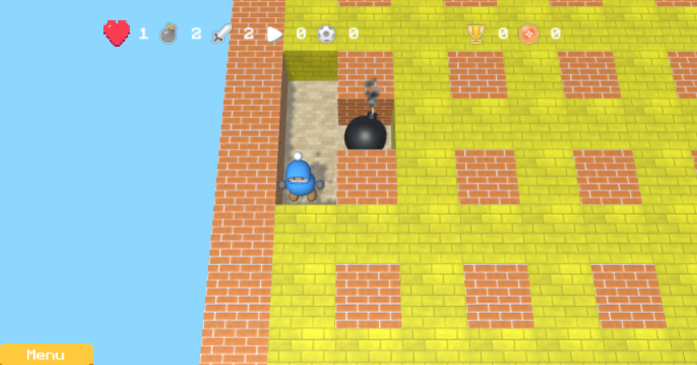

# Endless Bomberman in unity3d for phone and pc

This project is a endless Bomberman implementation developed in Unity3d.
I started by going through a tutorial, see link below.
Then I added content and functions to make a more complete game.

# How to start?
The game is developed to work with for Android, Windows and xCode.
In order to keep this repo within reasenable size, the releases won't be included
in this repo. To start, open project in unity. And :
* Unity - Run application in unity editor
* Android - Build for android, Put .apk file on android system, install and run.
* Windows - Build for windows, Just execute the .exe file in Release folder.
* xCode (iOS) - Build for xCode, needs to be built in xCode 10 or later.

# About the Game
Bomberman is a game developed for Sega Saturn. Today many releases of Bomberman exist.
The main goal of the game is to eliminate the enemies, by dropping bombs, to be the last man standing.
In this version of the game a door opens when you are alone on the map.
Exit through the door to move to a more advanced level.
This game is endless.

As mentioned above, this version assume from a tutorial.
 The features that I have implemented on my own are mainly:

* Mission progression - a mission progression system.
* Map generation - generate maps depending on level.
* Powerups - several powerups.
* Bots - a bot algorithm that uses a weight optimization method to decide how to walk.
The bots can be set to several behavior modes.
* Meny - several scenes and load animations.
* GUI - an easy userfriendly gui.
* Phone Ready - add controlls for phone usage and change some code to better suite phones.

# Screenshots
See screenshots below:

# Keys
Key descriptions

## Phone
Drop bomb - A button

Move - Joystick

## PC
Drop bomb - Enter

Move - Arrows

# Gameplay

# Source
Sources used during the development are described below.

## Tutorial

A great tutorial with downloadable links. Great start for a bomberman project:

https://www.raywenderlich.com/244-how-to-make-a-game-like-bomberman-with-unity

## Assets from Unity3d Store

* Virtual plug and play joystick - by LeoLuz
* 15 Original Bricks Textures 1.0  - by NevLext
* 2D PixelArt - Isometric Blocks 1.0 - by Devils Work.shop
* PBR Tile Texture Floor 1 - by randomze
* Cute Cartoon Mobile GUI - 97 png files! 1.0 - by HONETi
* Low Poly GUI Kit 1.1c - by SystemEra GmbH
* PowerUp particles 1.1.2 - by MHLab
